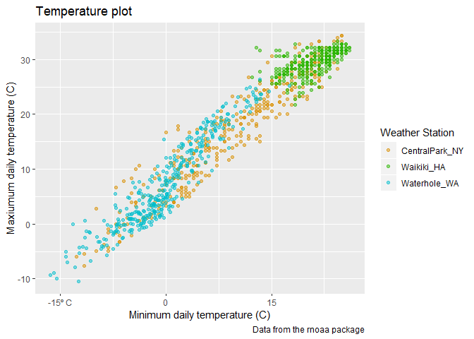
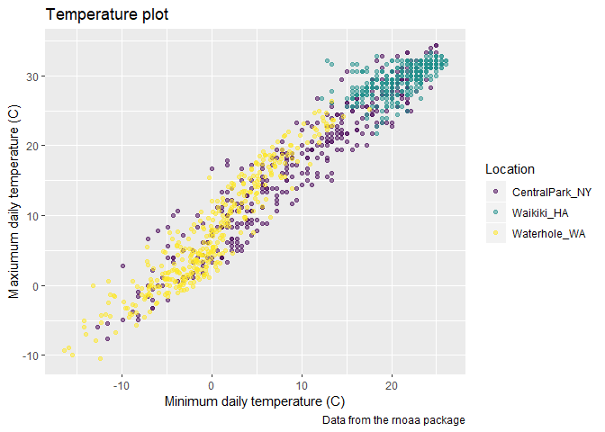

Visualization 2
================
Alison Elgass

``` r
library(tidyverse)
```

    ## -- Attaching packages ----------------------- tidyverse 1.2.1 --

    ## v ggplot2 3.2.1     v purrr   0.3.2
    ## v tibble  2.1.3     v dplyr   0.8.3
    ## v tidyr   1.0.0     v stringr 1.4.0
    ## v readr   1.3.1     v forcats 0.4.0

    ## -- Conflicts -------------------------- tidyverse_conflicts() --
    ## x dplyr::filter() masks stats::filter()
    ## x dplyr::lag()    masks stats::lag()

``` r
library(ggridges)
```

    ## 
    ## Attaching package: 'ggridges'

    ## The following object is masked from 'package:ggplot2':
    ## 
    ##     scale_discrete_manual

``` r
#library(patchwork)
```

# Load in & clean/tidy data

    ## Registered S3 method overwritten by 'crul':
    ##   method                 from
    ##   as.character.form_file httr

    ## Registered S3 method overwritten by 'hoardr':
    ##   method           from
    ##   print.cache_info httr

    ## file path:          C:\Users\aelga\AppData\Local\rnoaa\rnoaa\Cache/ghcnd/USW00094728.dly

    ## file last updated:  2019-09-26 10:34:45

    ## file min/max dates: 1869-01-01 / 2019-09-30

    ## file path:          C:\Users\aelga\AppData\Local\rnoaa\rnoaa\Cache/ghcnd/USC00519397.dly

    ## file last updated:  2019-09-26 10:35:26

    ## file min/max dates: 1965-01-01 / 2019-09-30

    ## file path:          C:\Users\aelga\AppData\Local\rnoaa\rnoaa\Cache/ghcnd/USS0023B17S.dly

    ## file last updated:  2019-09-26 10:35:41

    ## file min/max dates: 1999-09-01 / 2019-09-30

# Add labels & ticks

``` r
weather_df %>% 
  ggplot(aes(x = tmin, y = tmax)) + 
  geom_point(aes(color = name), alpha = .5) + 
  labs(
    title = "Temperature plot",
    x = "Minimum daily temperature (C)",
    y = "Maxiumum daily temperature (C)",
    caption = "Data from the rnoaa package"
  ) +
 scale_x_continuous(
    breaks = c(-15, 0, 15), 
    labels = c("-15º C", "0", "15")
  ) +
  scale_color_hue(
    name = "Weather Station",
    h = c(50, 200)
 )
```

    ## Warning: Removed 15 rows containing missing values (geom_point).

<!-- -->

# Create base plot, use Viridis Package

``` r
#This time we "save" the plot as a variable to use later
ggp_temp_plot = 
  weather_df %>% 
  ggplot(aes(x = tmin, y = tmax)) + 
  geom_point(aes(color = name), alpha = .5) + 
  labs(
    title = "Temperature plot",
    x = "Minimum daily temperature (C)",
    y = "Maxiumum daily temperature (C)",
    caption = "Data from the rnoaa package"
  ) + 
  viridis::scale_color_viridis(
    name = "Location", 
    discrete = TRUE
  )

ggp_temp_plot #now display it
```

    ## Warning: Removed 15 rows containing missing values (geom_point).

<!-- -->

## Themes (ORDER MATTERS)

``` r
ggp_temp_plot +
  theme_minimal() + #many theme options!
  theme(legend.position = "bottom")
```

    ## Warning: Removed 15 rows containing missing values (geom_point).

<!-- -->

### Side note on warnings

Warning message: remove 15 rows containing missing values It’s ok,
ggplot leaves them out of plot

``` r
#see these 15 rows have missing values 
weather_df %>% 
  filter(is.na(tmin))
```

    ## # A tibble: 15 x 6
    ##    name       id          date        prcp  tmax  tmin
    ##    <chr>      <chr>       <date>     <dbl> <dbl> <dbl>
    ##  1 Waikiki_HA USC00519397 2017-04-17     5  28.3    NA
    ##  2 Waikiki_HA USC00519397 2017-05-09    NA  NA      NA
    ##  3 Waikiki_HA USC00519397 2017-05-26    NA  NA      NA
    ##  4 Waikiki_HA USC00519397 2017-07-19    NA  NA      NA
    ##  5 Waikiki_HA USC00519397 2017-10-07     0  31.1    NA
    ##  6 Waikiki_HA USC00519397 2017-10-09     0  28.9    NA
    ##  7 Waikiki_HA USC00519397 2017-10-10    10  31.7    NA
    ##  8 Waikiki_HA USC00519397 2017-10-12     0  31.1    NA
    ##  9 Waikiki_HA USC00519397 2017-10-13     0  31.1    NA
    ## 10 Waikiki_HA USC00519397 2017-10-16     5  30      NA
    ## 11 Waikiki_HA USC00519397 2017-10-18     0  29.4    NA
    ## 12 Waikiki_HA USC00519397 2017-10-20    13  30.6    NA
    ## 13 Waikiki_HA USC00519397 2017-10-21     0  30      NA
    ## 14 Waikiki_HA USC00519397 2017-10-22     0  30      NA
    ## 15 Waikiki_HA USC00519397 2017-12-22     0  26.7    NA
